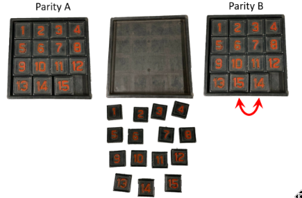
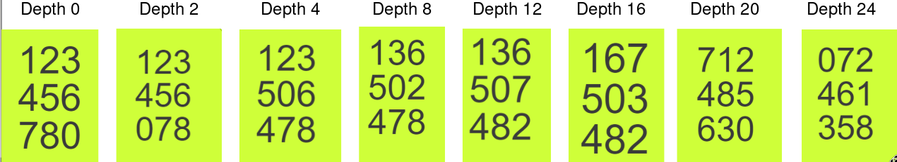
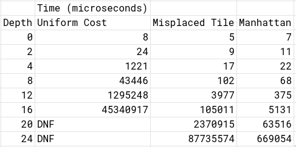
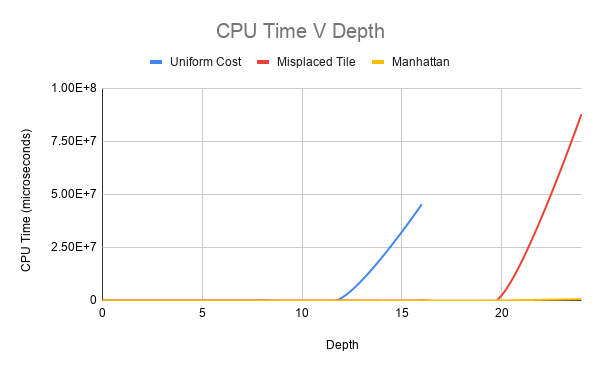
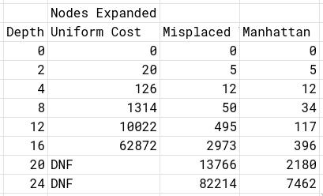
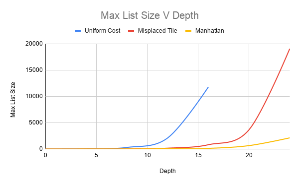
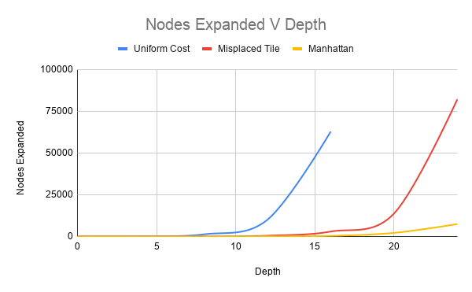
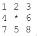
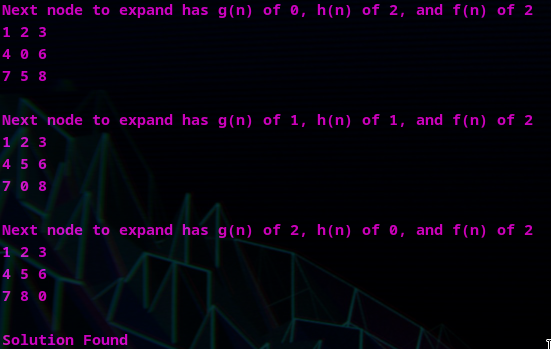

# The Eight Puzzle

## Introduction

Artificial Intelligence is utilized in a multitude of environments, from analysis of artifacts

from archaeological digs to the development of warfare strategies. However, as large as AI’s

scope encapsulates, its fundamentals revolve around the ability to concentrate enormous

amounts of data into meaningful decisions and analysis. This is exemplified quite well when

approaching The Eight Puzzle. The Eight Puzzle is set up with numbered tiles in a grid

like fashion. These tiles are mixed up with the objective of the puzzle to rearrange them

in chronological by sliding adjacent tiles into the empty space. Although, the focus of this

project was on The Eight Puzzle, variations of this puzzle are common by increasing or de-

creasing the number of tiles used. This is demonstrated in Figure 1 provided by Professor

Keogh’s PowerPoint slide.

Figure 1. An Example of a Fifteen Puzzle\
Source: Eight-Puzzle briefing and review of search (Eamonn Keogh)

An approach to solving this puzzle includes creating branches for every possible move from

a given state of the board. Although this would guarantee that if there is a solution from a

given starting state, that it would be found, it has the possibility of taking an extraordinary

amount of time and memory space to complete such an algorithm. AI combats this issue

by attributing a heuristic to expand nodes that are more likely to find a solution. Thus,

the large amount of information concentrated into meaningful data to dramatically increase

efficiency.

## Heuristic Analysis

A heuristic is a very rough approximation which allows for more educated decisions in a

problem set. In this project three separate heuristics were utilized.

### Uniform Cost Search

In a Uniform Cost Search the heuristic is equal for all given states. This method essentially

is a breadth first search as the heuristic does not allow for any additional information for

which nodes to expand.

### Misplaced Tile Heuristic

The Misplaced Tile Heuristic iterates over every tile (excluding the blank tile) and checks

whether it matches that of the goal state. For every tile that does not match the goal state,

the heuristics is incremented. Each node then finds the sum, denoted by f(n), of the cost

to arrive to the node, denoted by g(n), with the heuristic, denoted by h(n). When deciding

on which node to expand, the node with the smallest f(n) is chosen.

### Manhattan Distance Heuristic

The Manhattan Distance Heuristic calculates the distance an individual tile would need to

move to match the goal state if there were no tiles blocking its path. It calculates this for

each tile, once again excluding the blank tile, and takes the sum of all the distances. Simi-

larly to the Misplaced Tile Heuristic, it calculates a f(n) and chooses which node to expand

based on said calculation.

## Data Analysis

To analyse these three approaches to The Eight Puzzle, a set of eight different starting

boards, which were provided by Professor Keogh, were utilized. The solutions for each of

these starting boards had distinct depths which can be seen in Figure 2.

Figure 2. Set of eight starting boards with solutions depths labeled at the top\
Source: Eight-Puzzle briefing and review of search

In order to analyse the time and space complexity of each of these approaches, the CPU

time and maximum queue size were measured against solution depth.

The CPU time for each approach for shallow solutions were relatively similar; however, the

Uniform Cost Search quickly surpassed both the Misplaced Tile and the Manhattan Dis-

tance approaches. Furthermore, the Uniform Cost Search was unable to finish either board

with solution depth 20 or 24 in the maximum time allotted, 15 minutes. The algorithm

utilizing the Misplaced Tile Heuristic was able to finish all boards, but was outshined by the

Manhattan Distance Heuristic. The raw data can be referenced in Figure 3 and its graph

can be seen in Figure 4.

\
Figure 3. Raw data of CPU time in microseconds against solution depth

\
Figure 4. Graph of CPU Time against solution depth

Similar results were found when analysing the space complexity of these approaches. Al-

though the margin of difference as the depth of the solution increased was not as dramatic,

The Manhattan Distance Heuristic was the most efficient in finding the solution. The com-

parison of maximum queue size for each approach can be seen in the table shown in Figure

5 and the graph in Figure 6.

\
Figure 5. Raw data of the maximum size of queue and solution depth

\
Figure 6. Graph depicting maximum queue size against solution depth

Finally, the number of nodes expanded for each approach was counted. This reveals how

and why there are such drastic differences in time between each approach. By the time the

solution depth is 16, the Misplaced Tile approach has expanded 6.9% of the Uniform Cost

Search. Additionally, the Manhattan Distance Heuristic at this point has expanded 16% of

the Misplaced Tile approach and 1.1% of the Uniform Cost Search. This is seen if Figure

7 and Figure 8.

\
Figure 7. Raw data of the nodes expanded and solution depth

\
Figure 8. Graph depicting nodes expanded versus solution depth

## Conclusion

After analysis of the three approaches, it is fairly clear that the Manhattan Distance Heuristic

was able to find the solution in the least amount of time in addition to being the most efficient

and conservative with memory space. Furthermore, the Misplaced Tile Heuristic allowed for

a more efficient search than no meaningful heuristic such as the Uniform Cost Search.

The Uniform Cost Search, because it is essentially breadth first search, has a time complexity

of O(bd) where b is the branching factor and d is the depth of the solution.

Figure 10 shows the trace of the puzzle with starting state shown in Figure 9.

\
Figure 9. Starting state of puzzle shown by trace

\
Figure 10. Trace of calculations done by the Manhattan Distance Heuristic

## Works Consulted

• Eight Puzzle Briefing and Heuristic Search from lecture

• Project 1 Sample Report

• Wikipedia article for A\*

• cplusplus.com for references about stl structures

• techiedelight for reference to chrono and timing code
